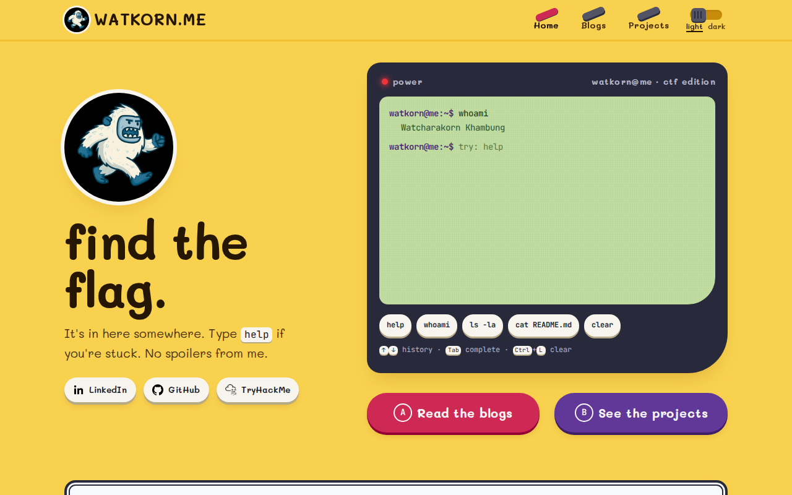
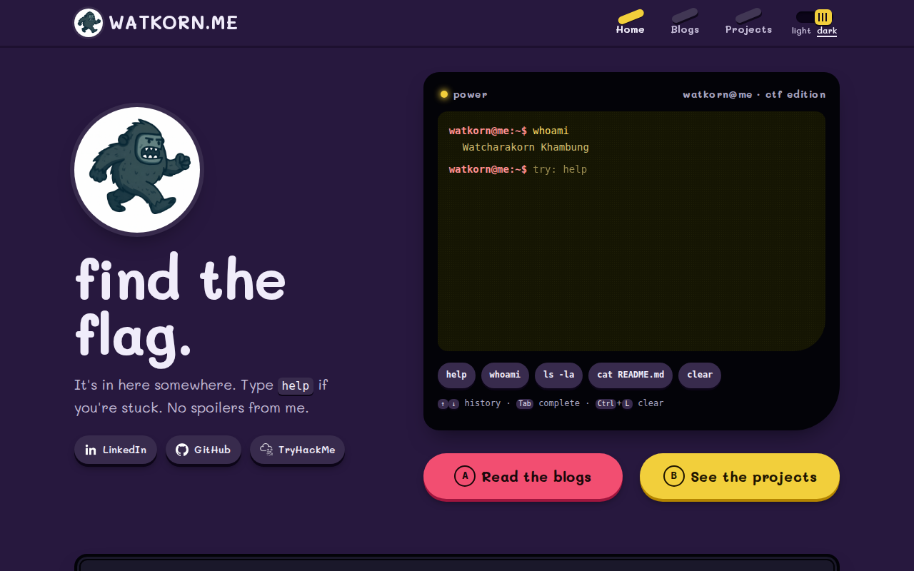

# WATKORN.ME

[](https://github.com/watkorn/watkorn.me/actions/workflows/deploy.yml)
[](https://github.com/watkorn/watkorn.me/actions/workflows/ci.yml)
[](https://github.com/watkorn/watkorn.me/releases)
[](LICENSE)
[](https://watkorn.me)

> The personal site of **Watcharakorn Khambung (watkorn)**: CTF writeups, security side projects,
> and a terminal on the home page with **eight flags** hidden around the site. Go find them.

| Light | Dark |
|---|---|
|  |  |

---

## Features

- **A mini CTF.** The home terminal (`ls`, `cd`, `cat`, `open`, `hint`, `submit`…) is the entry point to eight flags in two seasons, hidden around the site (and in a cookie, a vault and a picture). Flags are checked by SHA-256 hash, so reading the JavaScript won't hand you the answers. Progress lives on [`/achievements`](https://watkorn.me/achievements/), stored only in the visitor's browser.
- **Search and navigation.** `/search` finds any post or project by title, tag, heading or text (Thai included), from a static index that loads only when needed; press `/` anywhere. Long posts get a table of contents and `#` links on every heading.
- **Blogs and projects in Markdown**, with a CTF writeup template, category/difficulty badges, and tag filters on both lists (tags on a post or project link back to the filtered list).
- **English and Thai.** Every page exists at `/…` and `/th/…`, with a language key in the header, `hreflang` links, a Thai RSS feed and Thai translations of every post. The choice is remembered, and Thai browsers land on `/th/` from the home page.
- **Real URLs and pre-rendered pages.** Every page is built to its own HTML file, so posts are indexable and show proper link previews (Open Graph + Twitter cards). There's also a sitemap and an RSS feed.
- **Handheld Quest design** with a pixel yeti mascot, light and dark themes, from 320 px phones to wide desktops. See [`DESIGN.md`](DESIGN.md) and [`brand/`](brand/README.md).
- **Static and locked down.** Plain files on GitHub Pages behind Cloudflare: no server, no database, no third-party scripts, a strict CSP, and no source maps.

## Quick start

Requires **Node 20.19+** (CI runs Node 24).

```bash
npm install
npm start              # http://localhost:3000 (drafts are visible in dev)
```

| Command | What it does |
|---|---|
| `npm start` | Vite dev server; rebuilds content when any `.md` changes |
| `npm run new-post -- "My Title"` | New blog post in `content/blogs/` (as a draft) |
| `npm run new-post -- --writeup "Challenge"` | New **CTF writeup** from the template |
| `npm run new-post -- --th my-post` | Start the **Thai translation** of `content/blogs/my-post.md` |
| `npm run build` | Production build in `build/`: prerendered pages, 404, sitemap, RSS, link-preview images, security.txt, CSP. The images are drawn with Chromium (`npx playwright install chromium` once); without it they fall back to `og.png` with a warning |
| `npm run preview` | Serve the production build at http://localhost:4173 |
| `npm test` | Playwright smoke tests against the build (run `npm run build` first; first time also `npx playwright install chromium`) |

## Writing a post

```bash
npm run new-post -- --writeup "Baby ROP"       # or without --writeup for a normal post
```

That creates `content/blogs/baby-rop.md`. The file name becomes the URL: `https://watkorn.me/blogs/baby-rop/`.

````markdown
---
title: Baby ROP
description: One line shown in the list and in link previews
date: 2026-09-26
event: "Some CTF 2026"      # optional, writeups only
category: pwn               # web | pwn | crypto | forensics | rev | osint | misc
difficulty: easy            # easy | medium | hard | insane
tags: [ctf, rop]
draft: true                 # delete this line to publish
---

## Recon
```bash
checksec ./chall
```
````

- Images go in `public/images/blogs/`; reference them as `/images/blogs/<file>`.
- Code blocks are syntax-highlighted at build time and get a copy button.
- Commit and push to `main`. CI builds, tests and deploys by itself.

**Projects** work the same way in `content/projects/*.md`, with `category`, `order`, `tags`, `github` and `screenshots` fields. Project images go in `public/images/projects/`.

### Two languages

English lives at `/…`, Thai at `/th/…`. A translation is a second file next to the original:

```
content/blogs/baby-rop.md       ->  /blogs/baby-rop/
content/blogs/baby-rop.th.md    ->  /th/blogs/baby-rop/
```

- The `.th.md` file only needs `title` and `description` (and `screenshots` for a project, to translate the captions). The date, tags, category and so on come from the original. `npm run new-post -- --th baby-rop` creates it as a draft copy of the original, ready to translate.
- Not translated yet? The Thai page still exists: it shows the original with a note, points its canonical URL at the original, and stays out of the sitemap. A Thai-only post works too (`--th --slug my-post "ชื่อไทย"`).
- UI text is in [`src/i18n/strings.js`](src/i18n/strings.js); CTF hints are in [`src/ctf/ctf.js`](src/ctf/ctf.js). Terminal commands, file names and flags stay English on purpose.

<details>
<summary>ภาษาไทย: เขียนบล็อกใหม่ใน 3 ขั้น</summary>

1. `npm run new-post -- --writeup "ชื่อโจทย์ภาษาอังกฤษ"` (หรือไม่ใส่ `--writeup` สำหรับโพสต์ทั่วไป)
2. เขียนเนื้อหาใน `content/blogs/<ชื่อ>.md` แล้วดูตัวอย่างด้วย `npm start`
3. ลบบรรทัด `draft: true` แล้ว commit + push ขึ้น `main` เว็บจะ build, test และ deploy เองอัตโนมัติ

**ฉบับภาษาไทย:** `npm run new-post -- --th <ชื่อไฟล์>` จะสร้าง `content/blogs/<ชื่อไฟล์>.th.md` ที่ก๊อปต้นฉบับมาให้แปล (ใส่แค่ `title` กับ `description` ภาษาไทย ที่เหลือใช้ของต้นฉบับ) แปลเสร็จลบ `draft: true` แล้ว push หน้าภาษาไทยจะอยู่ที่ `/th/blogs/<ชื่อไฟล์>/` ถ้ายังไม่แปล หน้าไทยจะแสดงต้นฉบับพร้อมบอกไว้ ส่วนข้อความบนหน้าเว็บ (เมนู ปุ่ม ฯลฯ) แก้ได้ที่ `src/i18n/strings.js`

</details>

## The CTF (for maintainers)

- The levels, points, hints and **SHA-256 hashes** of the flags are in [`src/ctf/ctf.js`](src/ctf/ctf.js). The plaintext flags exist only in their hiding places on the site.
- [`tests/ctf-integrity.spec.js`](tests/ctf-integrity.spec.js) proves every flag can be found on the built site and matches its hash. If you move or change a flag, update both the hiding place and the hash, and this test will tell you if they disagree.
- Season 2 (levels 6–8) lives in [`src/ctf/season2.js`](src/ctf/season2.js): level 6's flag is AES-GCM encrypted and only decrypts for a forged `role=admin` session cookie, level 7's is XORed with one byte, and level 8's is hidden in the least significant bits of `public/images/blogs/ctftime.png`. **Don't re-save or optimise that image**, or the flag is gone (the integrity test would catch it).
- Heads-up: this repo is public, so a determined player can read the source. That's fine for a warm-up CTF; for harder challenges, keep the hiding places outside this repo.

## Project structure

```
content/             Markdown for blogs and projects (edit these)
index.html           Page template (Vite)
public/              Static files: CNAME, robots.txt, icons, og.png, theme-init.js
scripts/
  content.mjs        content/*.md → src/generated/*.json
  prerender.mjs      renders every route (en + th) to HTML + 404.html, sitemap.xml, rss.xml, th/rss.xml
  csp.mjs            adds the Content-Security-Policy to every HTML file
  new-post.mjs       scaffolds posts / writeups
src/
  components/ pages/ ctf/ data/ search/ styles/ theme/
  i18n/              language from the URL, every UI string in English and Thai
  entry-server.jsx   server entry used only for prerendering
  generated/         built from content/ (git-ignored)
tests/               Playwright smoke, i18n and CTF integrity tests
brand/               Yeti logo: sprite source, palettes, exports, Logo Lab
.github/             deploy.yml, ci.yml, release.yml, dependabot.yml
```

## Deployment, CI and releases

- **Every push to `main`** runs [`deploy.yml`](.github/workflows/deploy.yml): install → build → Playwright tests → publish `build/` to the **`gh-pages`** branch. If a test fails, nothing is published.
- **Branches and pull requests** run [`ci.yml`](.github/workflows/ci.yml): build, tests and **Lighthouse** (accessibility and SEO must score ≥ 90).
- **Dependabot** opens weekly PRs for npm packages and GitHub Actions; CI checks each one. Patch and minor updates **merge themselves** once the checks pass ([`dependabot-auto-merge.yml`](.github/workflows/dependabot-auto-merge.yml); needs Settings → General → *Allow auto-merge*), major ones wait for you. A **weekly scheduled deploy** (Tuesdays) ships those merges and refreshes `security.txt`. All Actions are pinned to commit SHAs.
- **Releases:** add a section to [`CHANGELOG.md`](CHANGELOG.md), bump `version` in `package.json`, then run **Actions → Release → Run workflow** with the version (e.g. `v1.2.0`), or push a tag. [`release.yml`](.github/workflows/release.yml) builds the site and creates the GitHub Release.
- Hosting: GitHub Pages (`gh-pages`, custom domain from `public/CNAME`), proxied through **Cloudflare** (SSL Full (strict), security headers).

## Security

- **Rated A+ on [securityheaders.com](https://securityheaders.com/?q=watkorn.me&followRedirects=on).** Cloudflare sends HSTS (1 year, includeSubDomains), CSP, X-Frame-Options, X-Content-Type-Options, Referrer-Policy, Permissions-Policy and COOP.
- The live site is static files only; there is nothing server-side to exploit.
- Every HTML page carries a strict `Content-Security-Policy`: no inline scripts **or** inline styles (`script-src 'self'; style-src 'self'; font-src 'self'`). The theme bootstrap lives in `public/theme-init.js` for that reason, and a test fails the build on any CSP violation. Cloudflare adds HSTS and the other security headers GitHub Pages can't set.
- Markdown is rendered at build time from files in this repo; visitor input is never rendered as HTML.
- **No third-party requests at all:** the fonts (Mali, JetBrains Mono) are self-hosted via `@fontsource`, so not even Google Fonts sees your IP.
- The only cookie is `yeti_session`, a first-party game cookie for CTF level 6. Nothing is tracked, and nothing is sent anywhere.
- Everything in the frontend bundle is public. Never put real secrets in `src/` or `content/`.

Found a real vulnerability? Please report it **privately** by email to **fkub0011@gmail.com** rather than in a public issue. The same contact is published at [`/.well-known/security.txt`](https://watkorn.me/.well-known/security.txt) (RFC 9116, regenerated with a fresh `Expires` on every build). The mini CTF flags are meant to be found, so they don't count.

## Tech

React 19 · React Router 7 · Vite · Tailwind CSS 4 (+ typography) · Fontsource · gray-matter · marked · highlight.js · Playwright · Lighthouse CI · GitHub Actions · GitHub Pages · Cloudflare

## License

[MIT](LICENSE) © 2025-2026 Watcharakorn Khambung. The mascot artwork and the blog content are © Watcharakorn Khambung.
